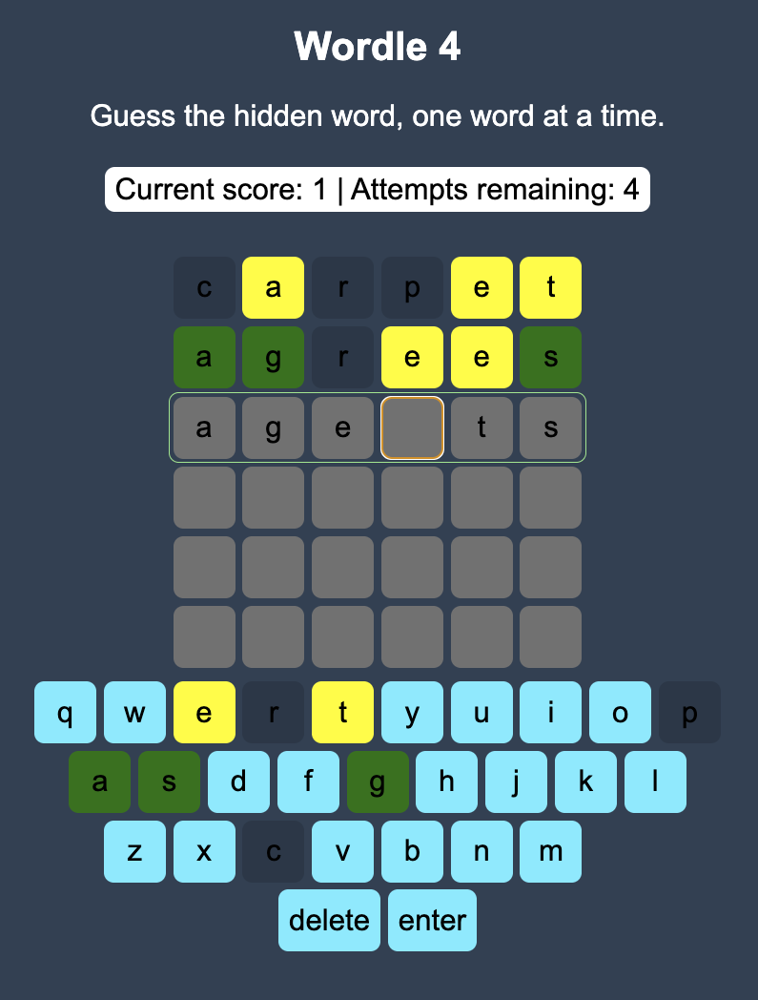

# wordle4

A six-letter Wordle-style game built with React and Vite. Each round gives you
six attempts to guess the secret word, with color feedback after every accepted
guess. Try the game [here](https://matevivan.github.io/wordle4/).

## Screenshot

Mid game screenshot:


## How the game works

1. Start a new round and wait for the six-letter secret word to load.
2. Type a six-letter guess with your keyboard or the on-screen keyboard.
3. Press `Enter` to submit the guess.
4. Use the tile colors to improve your next guess:
   - Green means the letter is in the correct position.
   - Yellow means the letter is in the word, but in a different position.
   - Gray means the letter is not in the word.
5. Guess the word within six attempts to add its word value to your score.
6. If you run out of attempts, the game reveals the word and subtracts its word
   value from your score.

## Local development

### Prerequisites

- Node.js `22.12.0` or newer
- npm `11.3.0` or newer

### First-time setup

1. Clone the repository.
2. Install dependencies:

   ```sh
   npm ci
   ```

3. Start the development server:

   ```sh
   npm start
   ```

4. Open the local Vite URL shown in your terminal, usually
   `http://localhost:5173`.

The game can run locally without an API key. If Word Checker is not configured
or is unavailable, word selection falls back to the bundled word list.

### Optional Word Checker API setup

New games can request a common six-letter word from the
[Word Checker API](https://wordchecker.io/developers/random-word-api/). Guesses
are checked against the bundled dictionary first. A locally unknown six-letter
guess is then checked through Word Checker and cached for the current app
session to reduce API usage.

To enable the API locally:

1. Create a RapidAPI account and subscribe to the Word Checker API.
2. Copy `.env.example` to `.env.local`.
3. Set `WORD_CHECKER_API_KEY` in `.env.local`.
4. Restart the Vite development server.

The browser requests `/api/word-checker`. Vite proxies that request to RapidAPI
and adds the key server-side, avoiding Word Checker's restrictive CORS header.
The previous `VITE_WORD_CHECKER_API_KEY` name is temporarily supported by the
development proxy, but should be renamed because `VITE_` variables are intended
for browser-visible values.

## Production API notes

GitHub Pages cannot run the Vite development proxy or protect an API key.
Deploy a server-side function that forwards the request to Word Checker, adds
the RapidAPI headers, and allows your GitHub Pages origin. Set its public URL as
`VITE_WORD_CHECKER_PROXY_URL` when building the app. Until that URL is
configured, production builds use the bundled word-list fallback.
